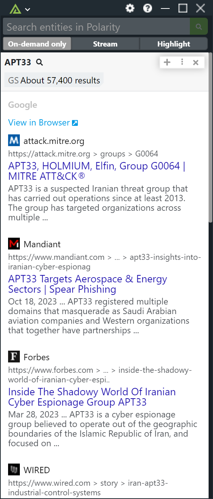

# Polarity - Google Search Integration

The Polarity Google Search integration allows the analyst to retrieve and display search results from Google, just like you were to search for terms using google.com. 

  

## Google Search Options

### API Key

Valid Google CSE API Key

### Max Results

Maximum Number of results to return per query.

## Installation Instructions

Generate a new CSE API key on the following page:

https://developers.google.com/custom-search/v1/overview

A free account allows for up to 100 search queries per day.

Once the API key has been generated, navigate to the CSE configuration site to create a new service engine:

https://cse.google.com/cse/create/new

Once the search engine has been generated, you can edit it to copy the Search engine ID which you will need for the integration settings.  Add additional sites that you would like to search on the edit page as well.

For a more detailed video tutorial, [Look Here](https://www.youtube.com/watch?v=vP_inGfKG5E).

Additional installation instructions for integrations are provided on the [PolarityIO GitHub Page](https://polarityio.github.io/).

## Polarity

Polarity is a memory-augmentation platform that improves and accelerates analyst decision making.  For more information about the Polarity platform please see:

https://polarity.io/
